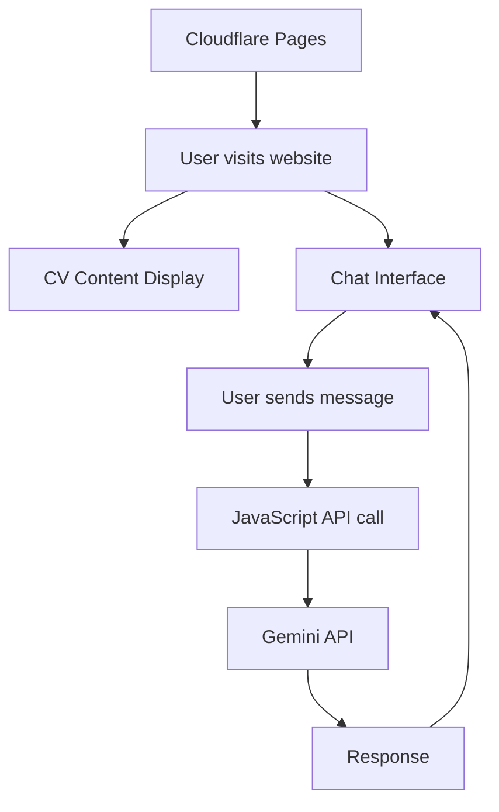

<!-- d902e4f2-8d1c-4672-b03e-c60e549fa4f4 359c8122-1d25-40d0-8623-1ff02bf94f6a -->
# CV Website with Gemini Chat Integration

## Overview

Build a modern, responsive CV website with an integrated chat interface powered by Google's Gemini API, ready for deployment on Cloudflare Pages.

## Architecture



## File Structure

```
Midterm/
├── index.html          # Main CV page with chat interface
├── styles.css          # Styling for CV and chat
├── script.js           # Chat functionality and Gemini API integration
├── wrangler.toml       # Cloudflare Pages configuration (optional)
├── .gitignore          # Exclude sensitive files
└── README.md           # Setup and deployment instructions
```

## Implementation Details

### 1. index.html

- **CV Section**: Display name, work experience, and study/education
- **Chat Interface**: Fixed or collapsible chat widget
- **Structure**: Semantic HTML5 with sections for CV content and chat container
- **Responsive**: Mobile-friendly layout

### 2. styles.css

- **Modern Design**: Clean, professional styling
- **Chat UI**: Styled chat interface with message bubbles
- **Responsive**: Media queries for mobile/tablet/desktop
- **Theme**: Professional color scheme suitable for CV

### 3. script.js

- **Gemini API Integration**: 
  - Function to call Gemini API endpoint
  - Handle API key from environment variable or config
  - Error handling for API failures
- **Chat Functionality**:
  - Send user messages
  - Display user and bot messages
  - Loading states
  - Message history management
- **API Configuration**: 
  - Use `GEMINI_API_KEY` environment variable
  - Fallback to config object for local development

### 4. Cloudflare Configuration

- **Environment Variables**: Set `GEMINI_API_KEY` in Cloudflare Pages dashboard
- **Build Settings**: Static site, no build step needed
- **Deployment**: Direct HTML/CSS/JS deployment

### 5. .gitignore

- Exclude API keys and sensitive configuration
- Standard Node.js ignores (if needed)

### 6. README.md

- Setup instructions
- How to add Gemini API key
- Cloudflare Pages deployment steps
- Local development guide

## Key Features

- **CV Display**: Professional presentation of name, work experience, and education
- **Chat Widget**: Always-accessible chat interface for visitor questions
- **API Security**: API key stored as environment variable, not in code
- **Responsive Design**: Works on all device sizes
- **Error Handling**: Graceful handling of API errors and network issues

## Technical Considerations

- **CORS**: Gemini API calls from browser (may need proxy or CORS-enabled endpoint)
- **API Key Security**: Never commit API key to repository
- **Rate Limiting**: Consider implementing rate limiting for chat requests
- **Local Testing**: Instructions for testing with API key before deployment